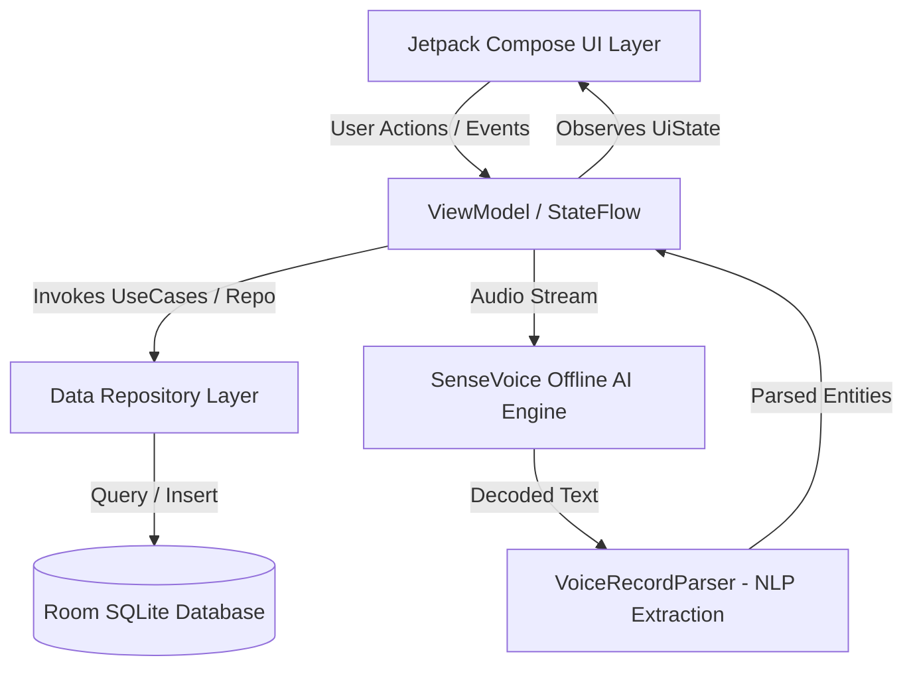

<p align="center">
  
</p>

<h1 align="center">GlycoFlow · 糖安记</h1>

<p align="center">
  <strong>专为糖友与银发长辈量身打造的端侧离线智能控糖助手 · 双模无障碍 · 隐私安全</strong>
</p>

<p align="center">
  <a href="https://kotlinlang.org/"></a>
  <a href="https://developer.android.com/jetpack/compose"></a>
  <a href="https://developer.android.com/about/versions/14"></a>
  <a href="https://github.com/alibaba-damo-academy/FunASR"></a>
  <a href="LICENSE"></a>
</p>

---

## 📖 项目简介 (Overview)

**GlycoFlow（糖安记）** 是一款基于 **Kotlin + Jetpack Compose** 构建的现代化 Android 血糖与胰岛素随访管理应用。

很多中老年及慢病患者在日常控糖中，常面临传统健康应用**“界面字号太小看不清”、“操作步骤繁琐”、“满屏弹窗广告”、“健康隐私上传云端泄露”**等痛点。**GlycoFlow** 从零重新思考慢病管理交互，首创**“标准专业模式 + 适老关怀模式”**无缝切换，并搭载 **100% 本地端侧离线语音大模型**，无需打字，说一句话即可自动分拣血糖、胰岛素、用药与运动，守护家人健康与隐私。

---

## ✨ 核心特性 (Key Features)

### 👵 1. 适老关怀模式 (Care Mode)
- **大字无障碍**：全界面 24~32sp 强化对比大号字体，告别老花镜。
- **立体气泡触控**：加厚圆角气泡输入框，提供精准点击手感与微步加减步进器（±0.1 mmol/L、±1 单位）。
- **自然时段防呆**：智能锚定当前就餐时段，杜绝未来日期翻页越界。
- **贴心语音播报**：内置高拟真 TTS 语音口播，录入完毕自动复述确认，银发群体零使用门槛。

### 📊 2. 现代专业看板 (Standard Mode)
- **卡片流仪表盘**：采用 Apple 设计语言与毛玻璃层次，空腹、餐前、餐后、睡前全天七大关键节点一目了然。
- **多维动态趋势**：集成 AGP 动态血糖图表、7/14/30 天滑动趋势曲线。
- **专业横屏表格**：支持一键横屏全景数据透视，直观排查胰岛素配比与餐后血糖波动。

### 🎙️ 3. 端侧离线智能语音 (SenseVoice-Small)
- **零网络秒级响应**：内置端侧高效语音模型，飞行模式或无网络环境下依然流畅使用。
- **长文本自然流淌**：
  > *“早起空腹血糖 6.2，打了 8 单位甘精胰岛素，吃了一片二甲双胍，饭后散步了半小时”*
- **智能语义自动解构**：全本地正则与语义引擎，一次性自动抽取出 **时段、血糖数值、胰岛素规格/剂量、口服药名/剂量、运动饮食** 等复合信息。
- **流式动画质感**：动态呼吸波纹，超长语音输入时自动向上平滑隐退，打造沉浸灵动体验。

### 💊 4. 全场景用药与饮食运动联动
- **多条目单次录入**：告别单条重复提交，单次弹窗即可完整录入血糖、注射、用药、饮食、运动全部指标。
- **智能药箱记忆**：按磺脲类、双胍类、DPP-4、SGLT-2 等自动分类，自动沉淀常用用药历史与剂量，一键点选。

### 🛡️ 5. 纯本地私密存储 (Local-First Privacy)
- **本地零外传**：所有健康数据仅保存在设备本地 Room SQLite 数据库中，不设云端收集服务器，保护个人医疗隐私。
- **冷热数据一键备份**：支持全量本地数据导出与导入迁移。

---

## 📱 界面展示 (Screenshots)

### 适老关怀模式 · 大字清晰、极简易用
| 关怀主页 (大卡片直观排版) | 适老复合录入 (大字防截断) | 智能药箱 (品类/历史/时机) |
|:---:|:---:|:---:|
|  |  |  |

### 智能语音交互 · 连续大段识别与自动提取
| 语音助理 (流式动效 & 向上滑动隐退) | 智能分拣多条实体 (自动归类) |
|:---:|:---:|
|  | *支持连续语音说出时段、血糖、胰岛素、用药与运动，秒级提取并一键保存* |

### 标准专业模式 · 丰富图表与数据全景
| 标准仪表盘 (卡片流看板) | 动态血糖趋势 (AGP 曲线) | 统计分析 (TIR / 变异度) |
|:---:|:---:|:---:|
|  |  |  |

---

## 🛠️ 技术架构 (Architecture)

本项目严格遵循 Google 官方倡导的 **Modern Android Architecture (MVVM + Clean Architecture)** 与单向数据流 (UDF) 范式：



### 核心技术栈
- **编程语言**：[Kotlin 2.0+](https://kotlinlang.org/)
- **UI 界面**：[Jetpack Compose](https://developer.android.com/jetpack/compose) + Material 3 + Accompanist Flow Layout
- **架构范式**：MVVM + Unidirectional Data Flow (StateFlow / SharedFlow)
- **本地数据库**：[Jetpack Room 2.6+](https://developer.android.com/training/data-storage/room) (SQLite)
- **端侧语音大模型**：SenseVoice-Small ONNX Runtime / Sherpa-ONNX 离线推理
- **异步处理**：Kotlin Coroutines + Flow
- **触感反馈与动效**：HapticFeedback + Jetpack Compose Animation

---

## 📂 项目结构 (Project Structure)

```text
app/src/main/java/com/example/
├── MainActivity.kt                  // 入口 Activity，双模切换与沉浸式状态栏配置
├── data/                            // 数据持久化与端侧离线语音
│   ├── AppDatabase.kt               // Room 数据库配置与迁移
│   ├── InsulinDao.kt                // 核心 CRUD 数据访问对象
│   ├── InsulinRecord.kt             // 实体模型 (时段/血糖/胰岛素/用药/饮食/运动)
│   ├── MedicationData.kt            // 常用降糖药字典与分类分类器
│   ├── VoiceRecordParser.kt         // 正则与规则驱动的自然语言实体提取引擎
│   ├── VoiceRecognitionManager.kt   // 离线语音录制与分发调度
│   └── SystemTtsManager.kt          // 关怀模式语音确认口播引擎
├── ui/                              // 界面表现层
│   ├── InsulinTrackerScreen.kt      // 主界面容器与顶层状态脚手架
│   ├── InsulinTrackerViewModel.kt   // 全局 ViewModel，业务逻辑与响应式状态
│   ├── CareFontSize.kt              // 关怀模式大字号系统定义
│   ├── components/
│   │   ├── CareHomeView.kt          // 适老关怀模式主页
│   │   ├── CareRecordDialog.kt      // 适老大字号复合录入弹窗
│   │   ├── SiriVoiceOverlay.kt      // 离线语音流式气泡与上滑隐退交互组件
│   │   ├── RecordTable.kt           // 标准模式多时段对比表格
│   │   ├── TrendChart.kt            // 血糖曲线与 AGP 趋势图表
│   │   ├── StatsView.kt             // 多日聚合统计视图
│   │   ├── FrostedGlassDialog.kt    // 高质感毛玻璃蒙层弹窗
│   │   └── AppleDesignEffects.kt    // 物理弹性与平滑过渡特效
│   └── theme/                       // Material 3 主题系统
```

---

## 🚀 快速上手 (Getting Started)

### 环境要求
- **Android Studio**：Ladybug (2024.2.1+) 或更新版本
- **JDK**：OpenJDK 17 / Oracle JDK 17
- **Android SDK**：API 35 (Android 15) Target SDK，最低兼容 API 26 (Android 8.0)
- **NDK**：26.1+ (用于 ONNX Runtime 离线推理加速)

### 编译与运行

1. **克隆代码仓库**
   ```bash
   git clone https://github.com/<your-username>/GlycoFlow.git
   cd GlycoFlow
   ```

2. **本地编译 Debug APK**
   - **Linux / macOS**:
     ```bash
     ./gradlew assembleDebug
     ```
   - **Windows (PowerShell)**:
     ```powershell
     .\gradlew.bat assembleDebug
     ```

3. **安装至真机或模拟器**
   ```bash
   adb install -r app/build/outputs/apk/debug/app-debug.apk
   ```

---

## 🔒 隐私与免责声明 (Privacy & Disclaimer)

1. **隐私承诺**：本项目作为离线优先（Local-First）工具，**绝不包含任何第三方跟踪 SDK、广告插件或数据收集服务**。麦克风权限仅在用户主动点击语音记录时请求，且所有音频数据直接送入设备芯片本地解码，计算完成后即刻销毁，永不上传。
2. **医疗免责声明**：本项目记录与统计功能仅作为日常自我健康管理参考，**不能替代专业医生的诊断、处方及治疗方案**。在调整胰岛素用量或更换降糖药物前，请务必咨询专业内分泌科医生。

---

## 📄 开源许可 (License)

本项目采用 [Apache License 2.0](LICENSE) 协议开源。欢迎自由学习、研究、二次开发或商业化使用，请保留原作者版权声明及修改说明。
