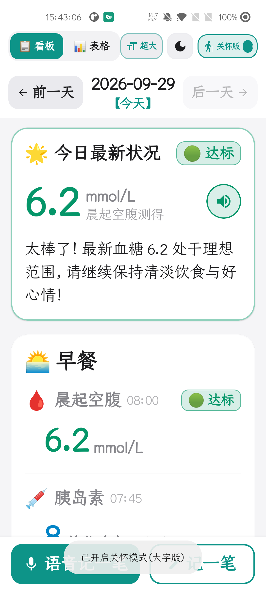
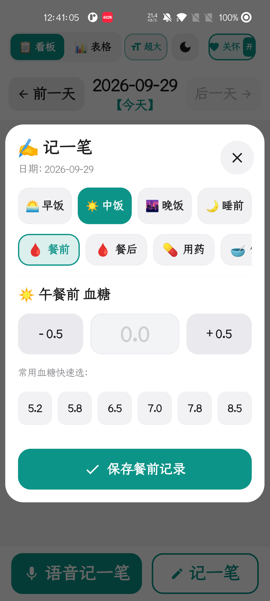
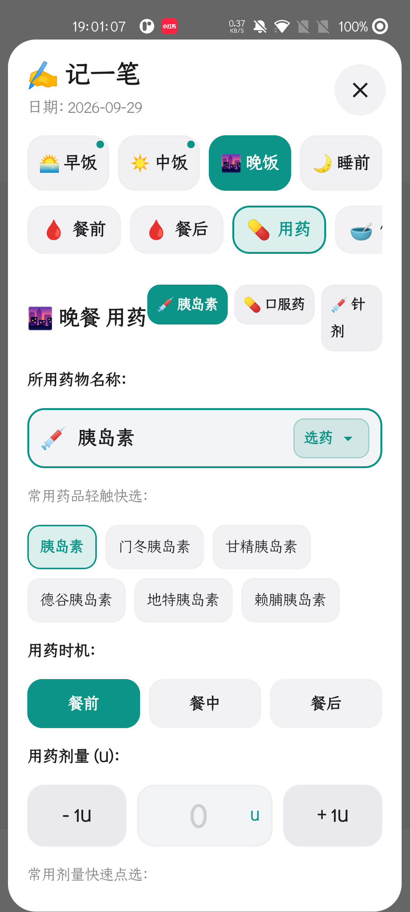
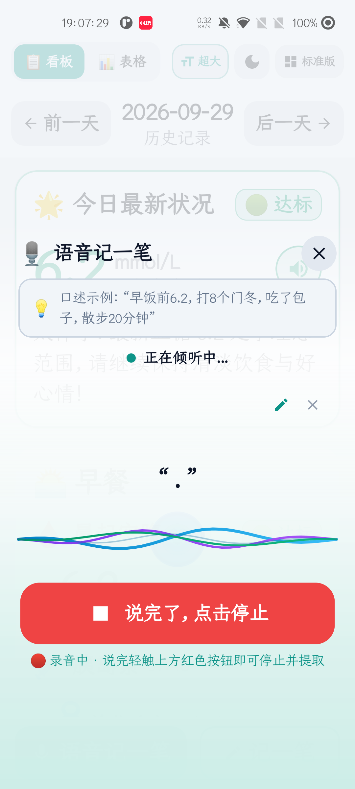
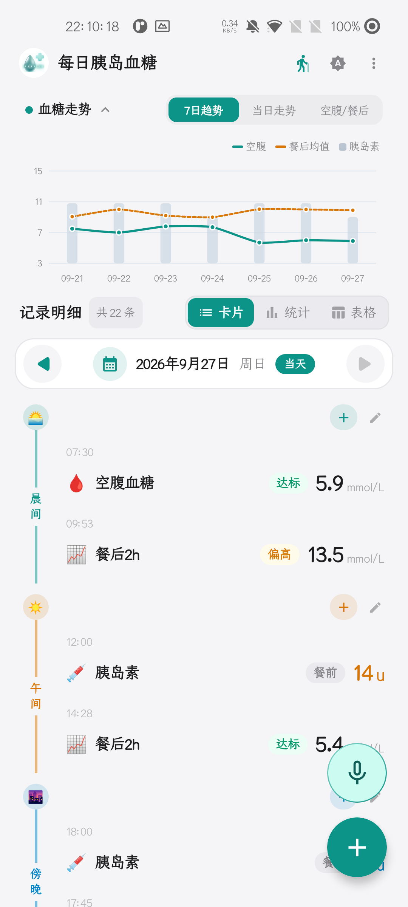
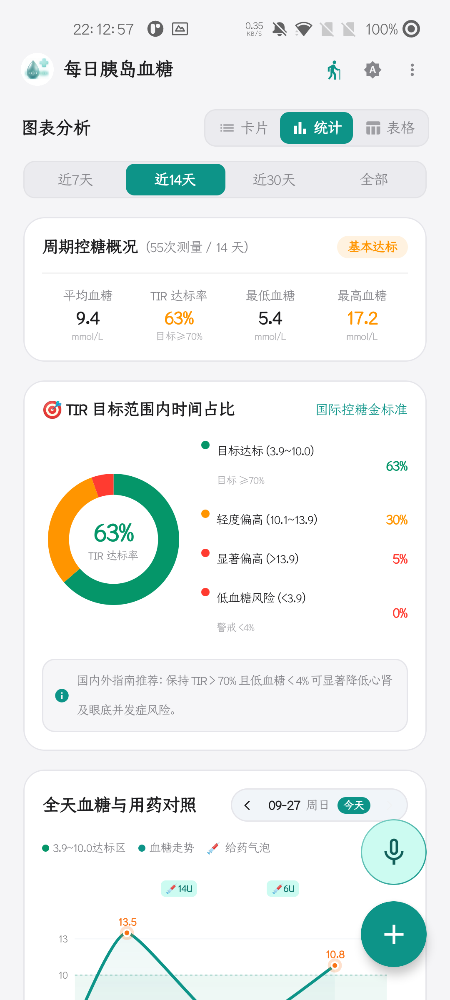
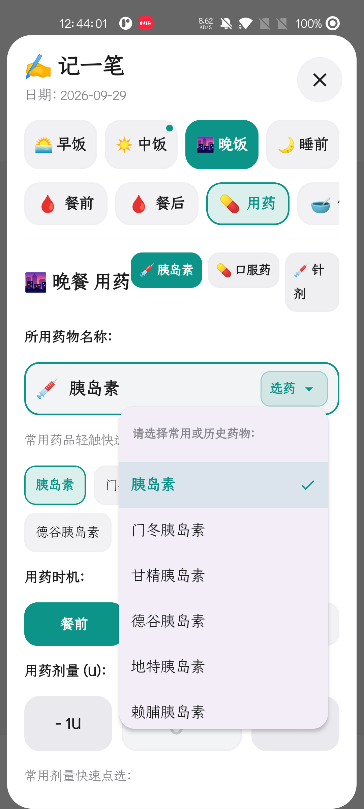
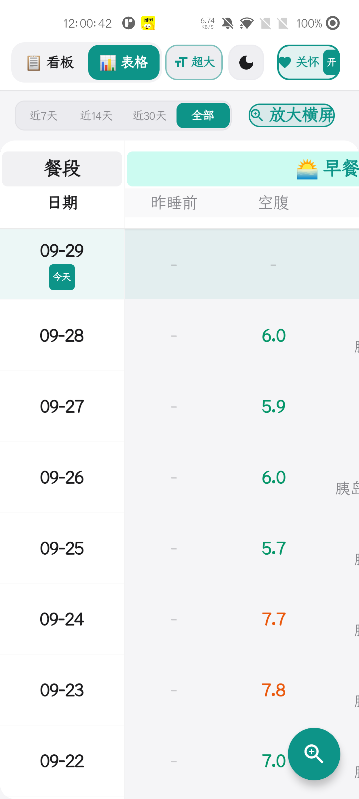
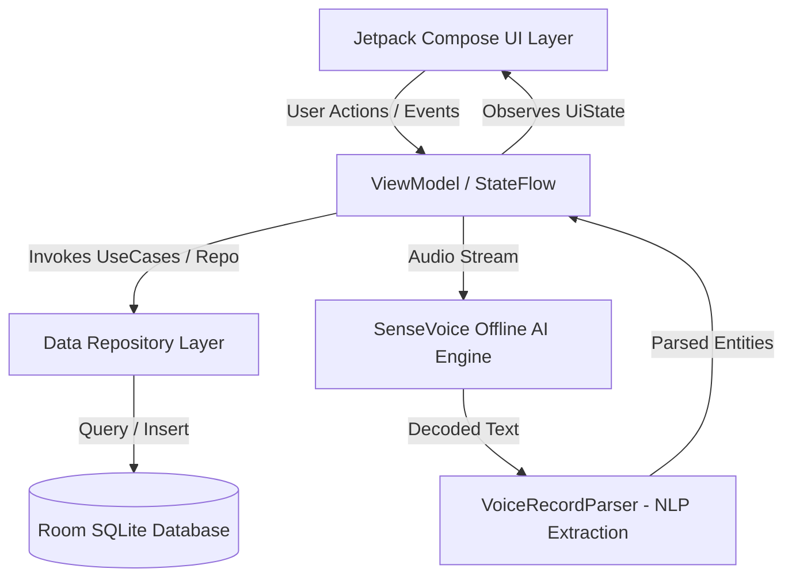

<div align="center">


# GlycoFlow · 糖安记

**专为糖友与银发长辈量身打造的端侧离线智能控糖助手 · 双模无障碍 · 隐私安全**

*(本项目全流程由 Google Gemini AI 辅助协同架构设计与工程实现)*

<p align="center">
  <a href="https://gemini.google.com/"></a>
  <a href="https://kotlinlang.org/"></a>
  <a href="https://developer.android.com/jetpack/compose"></a>
  <a href="https://developer.android.com/about/versions/14"></a>
  <a href="https://github.com/alibaba-damo-academy/FunASR"></a>
  <a href="LICENSE"></a>
</p>

</div>

> 📖 **官方使用说明书**：如需了解关怀模式操作、离线语音自然口述规范、临床图表解读与数据备份：  
> 👉 **[【点击直达下方完整说明书】](#user-guide)** *(页内秒级平滑定位，无跳转失败问题)*  
> 📄 **[或在 GitHub 查阅独立说明书文件 (USER_GUIDE.md)](./USER_GUIDE.md)**

---

## 📖 项目简介 (Overview)

**GlycoFlow（糖安记）** 是一款基于 **Kotlin + Jetpack Compose** 构建的现代化 Android 血糖与胰岛素随访管理应用。

很多中老年及慢病患者在日常控糖中，常面临传统健康应用**“界面字号太小看不清”、“操作步骤繁琐”、“满屏弹窗广告”、“健康隐私上传云端泄露”**等痛点。**GlycoFlow** 从零重新思考慢病管理交互，首创**“标准专业模式 + 适老关怀模式”**无缝切换，并搭载 **100% 本地端侧离线语音大模型**，无需打字，说一句话即可自动分拣血糖、胰岛素、用药与运动，守护家人健康与隐私。

---

## ✨ 核心特性 (Key Features)

### 👵 1. 适老关怀模式 (Care Mode)
- **大字无障碍**：全界面 24~32sp 强化对比大号字体，告别老花镜。
- **立体气泡触控**：加厚圆角气泡输入框，提供精准点击手感与微步加减步进器（±0.1 mmol/L、±1 单位）。
- **自然时段防呆**：智能锚定当前就餐时段，杜绝未来日期翻页越界。
- **贴心语音播报**：内置高拟真 TTS 语音口播，录入完毕自动复述确认，银发群体零使用门槛。

### 📊 2. 现代专业看板 (Standard Mode)
- **卡片流仪表盘**：采用 Apple 设计语言与毛玻璃层次，空腹、餐前、餐后、睡前全天七大关键节点一目了然。
- **多维动态趋势**：集成 AGP 动态血糖图表、7/14/30 天滑动趋势曲线。
- **专业横屏表格**：支持一键横屏全景数据透视，直观排查胰岛素配比与餐后血糖波动。

### 🎙️ 3. 端侧离线智能语音 (SenseVoice-Small)
- **零网络秒级响应**：内置端侧高效语音模型，飞行模式或无网络环境下依然流畅使用。
- **长文本自然流淌**：
  > *“早起空腹血糖 6.2，打了 8 单位甘精胰岛素，吃了一片二甲双胍，饭后散步了半小时”*
- **智能语义自动解构**：全本地正则与语义引擎，一次性自动抽取出 **时段、血糖数值、胰岛素规格/剂量、口服药名/剂量、运动饮食** 等复合信息。
- **流式动画质感**：动态呼吸波纹，超长语音输入时自动向上平滑隐退，打造沉浸灵动体验。

### 💊 4. 全场景用药与饮食运动联动
- **多条目单次录入**：告别单条重复提交，单次弹窗即可完整录入血糖、注射、用药、饮食、运动全部指标。
- **智能药箱记忆**：按磺脲类、双胍类、DPP-4、SGLT-2 等自动分类，自动沉淀常用用药历史与剂量，一键点选。

### 🛡️ 5. 纯本地私密存储 (Local-First Privacy)
- **本地零外传**：所有健康数据仅保存在设备本地 Room SQLite 数据库中，不设云端收集服务器，保护个人医疗隐私。
- **冷热数据一键备份**：支持全量本地数据导出与导入迁移。

---

## 📱 界面展示 (Screenshots)

### 适老关怀模式 · 大字清晰、极简易用
| 关怀主页 (大卡片直观排版) | 适老复合录入 (大字防截断) | 智能药箱 (品类/历史/时机) |
| :---: | :---: | :---: |
|  |  |  |

### 智能语音交互 · 连续大段识别与自动提取
| 语音助理 (流式动效 & 向上滑动隐退) | 智能分拣多条实体 (自动归类) |
| :---: | :---: |
|  | *支持连续自然口述时段、血糖、胰岛素、用药与运动，本地毫秒级提取并一键保存* |

### 标准专业模式 · 丰富图表与数据全景
| 标准仪表盘 (卡片流看板) | 动态血糖趋势 (AGP 曲线) | 统计分析 (TIR / 变异度) |
| :---: | :---: | :---: |
|  |  |  |

---

<a id="user-guide"></a>
## 📚 详细使用与操作说明书 (User Manual)

> 本章节为 GlycoFlow 的官方使用指南，涵盖从零安装、适老关怀模式日常使用、离线语音自然口述规范，到专业图表解读与数据备份全流程。

### 目录索引 (轻点快速定位)
- [1. 快速入门与权限声明](#user-guide-start)
- [2. 适老关怀模式使用指南](#user-guide-care)
- [3. 端侧离线智能语音操作口诀](#user-guide-voice)
- [4. 标准专业模式与图表解读](#user-guide-standard)
- [5. 数据安全与离线备份迁移](#user-guide-backup)
- [6. 常见问题排查 (FAQ)](#user-guide-faq)

---

<a id="user-guide-start"></a>
### 1. 快速入门与权限声明
- **麦克风权限说明**：首次启动请求录音权限，**仅用于本地离线声学模型解码**。本项目为 100% 离线应用（Local-First），音频数据在手机端侧芯片即时运算，**绝不上传任何云端服务器**，断网或飞行模式下功能完全一致。
- **双模式一键自由切换**：
  - 在关怀模式右上角点击带关怀手势图标的 **模式切换开关**，即可切换至标准专业看板；
  - 在标准模式顶部工具栏点击“关怀模式”图标，即可返回大字适老界面。

---

<a id="user-guide-care"></a>
### 2. 适老关怀模式使用指南（图文详解）

<div align="center">

| 关怀主页大字看板 | 记一笔立体大字录入 | 常用药下拉历史与分类 |
| :---: | :---: | :---: |
|  |  |  |

</div>

1. **主看板认知**：
   - 顶部显示今日日期，支持向左翻看既往历史，右侧禁止翻到未发生的未来日期；
   - 居中展示今日最新血糖大卡片，以绿色（正常 3.9~10.0）、蓝色（低血糖 < 3.9）、橙色（高血糖 > 10.0）状态胶囊警示。
2. **大字记一笔手把手流程**：
   - **步骤 1**：点击右下角橙色 **「记一笔」** 悬浮大按钮；
   - **步骤 2**：顶部轻点切换 **早餐 / 午餐 / 晚餐 / 睡前**；
   - **步骤 3**：气泡输入框采用 **32sp 强化居中大字**，彻底杜绝文字截断；
   - **步骤 4**：点击两侧加大 **「-」** / **「+」** 触控块，血糖以 **±0.1 mmol/L** 步进微调，胰岛素以 **±1 单位** 步进；
   - **步骤 5**：点击底部绿色大按钮「保存记录」，即刻入库。
3. **常用药与胰岛素快速点选**：
   - 顶部按双胍类、磺脲类、DPP-4、SGLT-2 等自动分类筛选；
   - 药名输入框右侧点击下拉箭头，即可唤出**高频历史用药**，轻点自动填入，无需长辈打字；
   - 底部提供 0.25片 / 0.5片 / 1片 / 2片 常用剂量颗粒；
   - “睡前”时段自动隐藏餐前/餐后就餐时机，科学防呆。
4. **TTS 语音复述口播确认**：
   - 保存记录后，手机自动语音播报核对（如：*“已保存早餐前记录：血糖 6.2，注射甘精胰岛素 8 单位”*），长辈不戴眼镜听声即可核对确认。
5. **横屏大字全景表格**：
   - 点击主页的放大横屏按钮，或横置手机，进入全览大字排列表（如下图），就诊时直接递给医生看：

<div align="center">
  
</div>

---

<a id="user-guide-voice"></a>
### 3. 端侧离线智能语音操作指南 (SenseVoice AI)

<div align="center">
  
</div>

- **触发方式**：点击主页底部的 **「说话记血糖」** 麦克风按钮，流式语音视口即刻浮现；
- **说话规范口诀（自然聊家常，无需刻意死记语法）**：
  - *“早上空腹血糖 6.2，打了 8 单位甘精胰岛素，吃了一片二甲双胍”*（复合信息一次说全）
  - *“中午吃完饭两小时血糖 7.8”*（餐后自动归类）
  - *“下午三点加餐吃了个苹果，吃了两颗阿卡波糖”*（加餐与用药联动）
  - *“晚饭后在公园散步了 40 分钟”*（运动备忘提取）
- **动态平滑上滑隐退**：连续大段口述时，先前说过的文字会自动向上平滑滑动并淡出渐隐，始终聚焦最新语句；
- **本地毫秒级提取**：停止说话后系统秒级分拣出数值与类别，确认无误一键入库。

---

<a id="user-guide-standard"></a>
### 4. 标准专业模式与图表解读

<div align="center">

| 标准看板卡片流 | 动态血糖趋势 (AGP 风格) | 多日聚合统计与 TIR 达标率 |
| :---: | :---: | :---: |
|  |  |  |

</div>

- **全天七大生理时段卡片流**：空腹、早餐后、午餐前、午餐后、晚餐前、晚餐后、睡前；
- **动态 AGP 血糖趋势曲线**：展示全天血糖波动起伏与峰谷规律；
- **TIR (Time in Range) 目标范围内时间比**：
  - 绿色达标区间（3.9 ~ 10.0 mmol/L）；
  - 《中国 2 型糖尿病防治指南》建议 2 型糖友争取维持 TIR ≥ 70%；
- **变异系数 (CV)**：CV < 33% 代表血糖波动平稳，提示低血糖风险较低。
- **记录修改与长按防误触删除**：长按卡片弹出高对比度防误触二次确认框，安全稳妥。

---

<a id="user-guide-backup"></a>
### 5. 数据安全与离线备份迁移
- **Local-First 架构**：无手机号注册，无账号密码，所有健康记录只保存在本机系统沙盒内的加密 Room SQLite 数据库；
- **换机数据迁移**：进入设置支持全量数据导出为标准备份文件，新手机安装后导入即可无缝恢复所有历史明细。

---

<a id="user-guide-faq"></a>
### 6. 常见问题排查 (FAQ)
- **Q1: 语音识别提示“未听到声音”？**  
  *请检查系统设置是否允许应用访问麦克风；端侧模型首次初始化约需 1 秒，看到声波律动后再开始口述即可。*
- **Q2: 误记了数值或时段如何修改或删除？**  
  *直接点击卡片可重新编辑并修正时段；长按任意记录条目，在弹出的防误触确认框中选择删除。*
- **Q3: 换手机后原手机的数据还在吗？**  
  *由于本应用不设云端服务器，换机前请在设置中导出本地备份文件发送到新手机并导入即可。*

---

## 🛠️ 技术架构 (Architecture)

本项目严格遵循 Google 官方倡导的 **Modern Android Architecture (MVVM + Clean Architecture)** 与单向数据流 (UDF) 范式：



### 核心技术栈
- **编程语言**：[Kotlin 2.0+](https://kotlinlang.org/)
- **UI 界面**：[Jetpack Compose](https://developer.android.com/jetpack/compose) + Material 3 + Accompanist Flow Layout
- **架构范式**：MVVM + Unidirectional Data Flow (StateFlow / SharedFlow)
- **本地数据库**：[Jetpack Room 2.6+](https://developer.android.com/training/data-storage/room) (SQLite)
- **端侧语音大模型**：SenseVoice-Small ONNX Runtime / Sherpa-ONNX 离线推理
- **AI 协同工程**：Google Gemini
- **异步处理**：Kotlin Coroutines + Flow
- **触感反馈与动效**：HapticFeedback + Jetpack Compose Animation

---

## 📂 项目结构 (Project Structure)

```text
app/src/main/java/com/example/
├── MainActivity.kt                  // 入口 Activity，双模切换与沉浸式状态栏配置
├── data/                            // 数据持久化与端侧离线语音
│   ├── AppDatabase.kt               // Room 数据库配置与迁移
│   ├── InsulinDao.kt                // 核心 CRUD 数据访问对象
│   ├── InsulinRecord.kt             // 实体模型 (时段/血糖/胰岛素/用药/饮食/运动)
│   ├── MedicationData.kt            // 常用降糖药字典与分类分类器
│   ├── VoiceRecordParser.kt         // 正则与规则驱动的自然语言实体提取引擎
│   ├── VoiceRecognitionManager.kt   // 离线语音录制与分发调度
│   └── SystemTtsManager.kt          // 关怀模式语音确认口播引擎
├── ui/                              // 界面表现层
│   ├── InsulinTrackerScreen.kt      // 主界面容器与顶层状态脚手架
│   ├── InsulinTrackerViewModel.kt   // 全局 ViewModel，业务逻辑与响应式状态
│   ├── CareFontSize.kt              // 关怀模式大字号系统定义
│   ├── components/
│   │   ├── CareHomeView.kt          // 适老关怀模式主页
│   │   ├── CareRecordDialog.kt      // 适老大字号复合录入弹窗
│   │   ├── SiriVoiceOverlay.kt      // 离线语音流式气泡与上滑隐退交互组件
│   │   ├── RecordTable.kt           // 标准模式多时段对比表格
│   │   ├── TrendChart.kt            // 血糖曲线与 AGP 趋势图表
│   │   ├── StatsView.kt             // 多日聚合统计视图
│   │   ├── FrostedGlassDialog.kt    // 高质感毛玻璃蒙层弹窗
│   │   └── AppleDesignEffects.kt    // 物理弹性与平滑过渡特效
│   └── theme/                       // Material 3 主题系统
```

---

## 🚀 快速上手 (Getting Started)

### 环境要求
- **Android Studio**：Ladybug (2024.2.1+) 或更新版本
- **JDK**：OpenJDK 17 / Oracle JDK 17
- **Android SDK**：API 35 (Android 15) Target SDK，最低兼容 API 26 (Android 8.0)
- **NDK**：26.1+ (用于 ONNX Runtime 离线推理加速)

### 编译与运行

1. **克隆代码仓库**
   ```bash
   git clone https://github.com/<your-username>/GlycoFlow.git
   cd GlycoFlow
   ```

2. **本地编译 Debug APK**
   - **Linux / macOS**:
     ```bash
     ./gradlew assembleDebug
     ```
   - **Windows (PowerShell)**:
     ```powershell
     .\gradlew.bat assembleDebug
     ```

3. **安装至真机或模拟器**
   ```bash
   adb install -r app/build/outputs/apk/debug/app-debug.apk
   ```

---

## 🔒 隐私与免责声明 (Privacy & Disclaimer)

1. **隐私承诺**：本项目作为离线优先（Local-First）工具，**绝不包含任何第三方跟踪 SDK、广告插件或数据收集服务**。麦克风权限仅在用户主动点击语音记录时请求，且所有音频数据直接送入设备芯片本地解码，计算完成后即刻销毁，永不上传。
2. **医疗免责声明**：本项目记录与统计功能仅作为日常自我健康管理参考，**不能替代专业医生的诊断、处方及治疗方案**。在调整胰岛素用量或更换降糖药物前，请务必咨询专业内分泌科医生。

---

## 📄 开源许可 (License)

本项目采用 [Apache License 2.0](LICENSE) 协议开源。欢迎自由学习、研究、二次开发或商业化使用，请保留原作者版权声明及修改说明。
