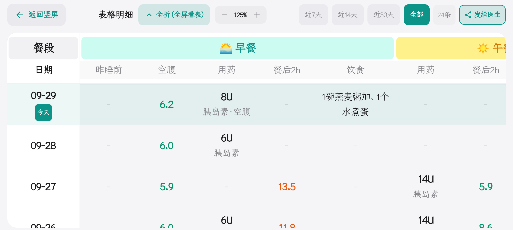
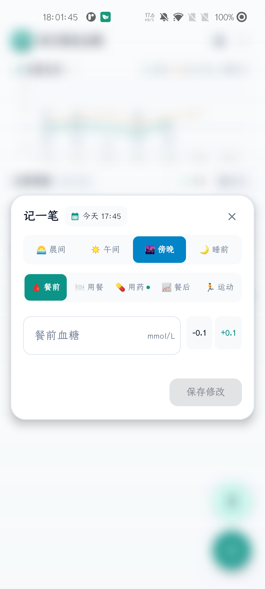

# 📖 GlucoDaily（糖舒心）全功能详细使用说明书

### 现代化 Android 离线智能控糖与胰岛素随访系统 · 官方图文操作指南

*(专为糖友、银发长辈及慢病照护家属编写 · 图文对照 · 快速上手)*

---

## 📑 目录索引
- [第一章：新手安装与首次使用配置](#第一章新手安装与首次使用配置)
  - [1.1 麦克风录音权限与 100% 离线隐私保障](#11-麦克风录音权限与-100-离线隐私保障)
  - [1.2 双模式（适老关怀模式 ⇄ 标准专业看板）一键切换](#12-双模式适老关怀模式--标准专业看板一键切换)
- [第二章：适老关怀模式（深度图文教程）](#第二章适老关怀模式深度图文教程)
  - [2.1 主界面核心功能分布图解](#21-主界面核心功能分布图解)
  - [2.2 手把手「记一笔」操作全流程](#22-手把手记一笔操作全流程)
  - [2.3 智能药箱：品类选择、常用药历史与剂量点选](#23-智能药箱品类选择常用药历史与剂量点选)
  - [2.4 语音自动口播复述确认（TTS）](#24-语音自动口播复述确认tts)
  - [2.5 日期历史查看与未来日期防呆机制](#25-日期历史查看与未来日期防呆机制)
  - [2.6 放大横屏展示 & 一键发给医生（随访数据表格与临床报告分享）](#26-放大横屏展示--一键发给医生随访数据表格与临床报告分享)
- [第三章：端侧离线智能语音全流程指南 (SenseVoice AI)](#第三章端侧离线智能语音全流程指南-sensevoice-ai)
  - [3.1 怎么唤醒语音录入](#31-怎么唤醒语音录入)
  - [3.2 自然语言表达 6 种经典场景实测口诀](#32-自然语言表达-6-种经典场景实测口诀)
  - [3.3 社交媒体式平滑上滑隐退动效与实体自动提取](#33-社交媒体式平滑上滑隐退动效与实体自动提取)
- [第四章：标准专业模式深度解析](#第四章标准专业模式深度解析)
  - [4.1 全天七大生理时段卡片流](#41-全天七大生理时段卡片流)
  - [4.2 临床动态趋势图表解读（AGP 曲线 / TIR 达标率 / CV 变异度）](#42-临床动态趋势图表解读agp-曲线--tir-达标率--cv-变异度)
  - [4.3 记录的重新修改与长按防误触删除](#43-记录的重新修改与长按防误触删除)
- [第五章：数据本地安全与换机离线备份](#第五章数据本地安全与换机离线备份)
- [第六章：常见疑难排查与实用技巧 (FAQ)](#第六章常见疑难排查与实用技巧-faq)
- [附录：中国 2 型糖尿病临床血糖控制目标参考表](#附录中国-2-型糖尿病临床血糖控制目标参考表)

---

## 第一章：新手安装与首次使用配置

### 1.1 麦克风录音权限与 100% 离线隐私保障
首次打开 GlucoDaily 时，Android 系统会弹出如下权限请求：
> **“允许‘GlucoDaily’录制音频吗？”**

| 权限用途 | 传统云端健康 App | GlucoDaily（糖舒心） |
| :--- | :--- | :--- |
| **数据传输** | 上传到远程服务器转写 | **100% 手机芯片本地推理，零上传** |
| **网络要求** | 必须联网或 WiFi | **断网、飞行模式下依然秒级识别** |
| **隐私安全** | 存在健康数据泄露风险 | **计算完毕立即释放，数据绝不出手机** |

请放心点击 **“仅在使用中允许”** 或 **“始终允许”**。本项目为纯本地离线应用（Local-First），麦克风仅用于端侧语音大模型（SenseVoice-Small）在本地芯片上做声学特征提取，**绝无任何云端上报或广告监听行为**。

---

### 1.2 双模式（适老关怀模式 ⇄ 标准专业看板）一键切换
应用支持针对不同使用场景的两种界面布局：

| 模式对比 | 适老关怀模式 (Care Mode) | 标准专业看板 (Standard Mode) |
| :---: | :---: | :---: |
| **界面展示** |  |  |
| **适用人群** | 银发长辈、老花眼、追求极简高效的用户 | 青年糖友、妊娠期血糖精细化记录、医生随访 |
| **字体规格** | **24 ~ 32sp 超大号粗体**，高对比度 | 现代紧凑设计，层次分明 |
| **核心特点** | 单日状态聚焦、大字立体气泡、语音播报 | 七大时段看板流、AGP 曲线图、TIR 达标率 |

> 🔄 **切换方法**：
> - **从关怀模式切到标准模式**：点击关怀主页右上角的 **模式开关按钮**（带关怀爱心手势图标），即可一键回到标准看板；
> - **从标准模式切到关怀模式**：点击标准看板顶部导航栏上的 **“适老模式”** 图标，即可瞬间切换至大字关怀模式。

---

## 第二章：适老关怀模式（深度图文教程）

### 2.1 主界面核心功能分布图解

  

1. **顶部日期导航区**：
   - 居中显示当前日期（如 `9月29日`）；
   - 左侧 **`<` 箭头**：翻看昨天的历史记录；
   - 右侧 **`>` 箭头**：当处于今天时，**右箭头自动置灰禁用**，杜绝老年人翻到“未发生的明天”产生困惑。
2. **中心血糖状态大卡片**：
   - 显示最近一次测量的血糖值（如 `6.5 mmol/L`）与对应时段（如 `空腹`）；
   - **三色健康胶囊预警**：
     - 🟢 **达标（绿色）**：处于健康控制目标区间（3.9 ~ 10.0 mmol/L）；
     - 🔵 **偏低（蓝色）**：血糖低于 3.9 mmol/L，提醒预防低血糖，及时补充含糖食物；
     - 🟠 **偏高（橙色）**：血糖高于 10.0 mmol/L，提醒关注就餐与注射用药。
3. **时段快捷选择胶囊**：
   - 提供 **早餐 / 午餐 / 晚餐 / 睡前** 4 个大号按键，轻点直接高亮定位对应时段。
4. **横屏放大按键**：
   - 点击卡片右上方 **「放大/横屏」** 图标，全屏展开大字对比表格。
5. **底部操作专区**：
   - 右下角 **橙色「记一笔」大圆钮**：唤起手工大字弹窗；
   - 底部 **绿色「说话记血糖」麦克风悬浮按钮**：开启离线语音记录。

---

### 2.2 手把手「记一笔」操作全流程

  

#### 详细操作步骤：
- **步骤 1：唤起弹窗**  
  点击右下角橙色 **「记一笔」** 悬浮按钮，弹出大字录入窗口。
- **步骤 2：确认就餐时段**  
  顶部选择本次记录属于 **早餐、午餐、晚餐 还是 睡前**（系统默认自动根据当前时间智能推荐当前餐次）。
- **步骤 3：选择记录指标**  
  中间大号标签栏支持一键切换录入：
  - **血糖**（空腹 / 餐后 1h / 2h / 3h）
  - **胰岛素**（速效 / 长效，剂量输入）
  - **用药**（口服降糖药分类与剂量）
  - **饮食**（主食、蔬菜、蛋白质）
  - **运动**（散步、慢跑、太极、家务）
- **步骤 4：32sp 居中大字输入与微调步进**  
  - 血糖与剂量框采用 **32sp 强化粗体字，绝对居中，永不截断**；
  - 视力不便的长辈无需调出手机软键盘，可直接点击两旁的 **加大「－」和「＋」按钮**：
    - 血糖数值：轻点以 **±0.1 mmol/L** 为步长精细微调；
    - 胰岛素：轻点以 **±1 单位（U）** 步进增减。
- **步骤 5：保存记录**  
  轻点底部大号绿色按钮 **「保存记录」**，数据即刻安全保存并触发语音播报。

---

### 2.3 智能药箱：品类选择、常用药历史与剂量点选

| 用药选择器界面 | 常用药下拉历史与分类 |
| :---: | :---: |
|  |  |

为了解决老年长辈打字慢、药品专业名词长、容易输错的痛点，GlucoDaily 专门研发了**智能无障碍药箱系统**：

1. **常用降糖药分类直达**：
   - 顶部提供 **双胍类（如二甲双胍）**、**磺脲类（如格列美脲）**、**α-糖苷酶抑制剂（如阿卡波糖）**、**DPP-4抑制剂（如西格列汀）**、**SGLT-2抑制剂（如达格列净）** 等科学分类胶囊，长辈根据药盒类型一键筛选。
2. **高频常用药下拉记忆（如右图）**：
   - 点击药名输入框右侧的 **下拉小三角箭头**，系统会自动弹出浮层，展示**最近高频使用的药物名录**；
   - 长辈只需用手指轻轻一点，药品名称立刻填入，一次打字都不需要！
3. **就餐时机智能化防呆**：
   - 界面直观提供 **餐前 / 餐中 / 餐后** 大字选项；
   - **智能防呆逻辑**：当记录时段切换为“睡前”时，系统会自动隐藏这三个就餐时机选项，避免长辈在睡前选错餐前餐后。
4. **快捷剂量颗粒点选**：
   - 提供 **0.25片 / 0.5片 / 1片 / 2片** 常用胶囊块，轻点直接完成用药量填写。

---

### 2.4 语音自动口播复述确认（TTS）
长辈保存完记录后，经常担心：“刚才我到底记上没有？数字有没有点错？”  
GlucoDaily 内置了 **系统级高品质 TTS 语音朗读引擎**：
- 每次在关怀模式下点击保存后，扬声器会自动以温和亲切的语速口播复述：
  > 🔊 *“已为您记录今天早餐前数据：血糖 6.2，注射甘精胰岛素 8 单位，口服二甲双胍 1 片。控制得很棒，请继续保持！”*
- 长辈无需凑近屏幕核对，听声音就能确定记录完全正确。

---

### 2.5 日期历史查看与未来日期防呆机制
- **查看历史记录**：点击顶部日期两侧的 **`<` 按钮**，可以翻看昨天、前天、大前天的全量血糖与用药卡片；
- **防呆安全锁**：当翻回到“今天”时，右侧前进按钮会自动灰化并锁定，防止长辈不小心点到未来未发生的日期而误记数据。

---

### 2.6 放大横屏展示 & 一键发给医生（随访数据表格与临床报告分享）

  
  

- **使用场景**：每周自测总结、去医院内分泌科门诊复查就医，或向主管医生、营养师远程汇报血糖；
- **打开表格视图**：在关怀模式顶栏点击 **「表格」** 标签，即可进入清晰大字表格浏览，顶部支持近7天、近14天、近30天与全部数据快速筛选；
- **操作双按键（屏幕底部常驻）**：
  1. **`[ 🔍 放大横屏 ]`**：
     - 点击后手机立即旋转进入全屏纯表格横屏透视模式，状态栏自动沉浸隐退；
     - 包含空腹、餐后、用药、胰岛素、饮食全部维度；
     - 支持双指自由捏合缩放（0.75x ~ 2.5x 舒适大字自由调节）及 **「全折 (全屏看表)」** 模式，实现 100% 满屏无干扰查表。
  2. **`[ 📤 发给医生 ]`**：
     - 点击后系统直接自动生成临床就诊专用的结构化随访数据；
     - **免去复杂导出配置**：直接随附带有 UTF-8 BOM 编码的 Excel/CSV 表格文件（`血糖随访数据表_日期.csv`），医生电脑/手机双击即可直接打开，绝无乱码；
     - **内置结构化文本报告**：包含监测周期、血糖测定总次数、空腹均值、餐后均值、目标范围内时间 (TIR) 达标率、低血糖警戒次数及每日各餐明细；
     - **一键调起系统分享**：直接发送到医生微信、企业微信、短信或邮件，医生点开即看。

---

## 第三章：端侧离线智能语音全流程指南 (SenseVoice AI)

  

### 3.1 怎么唤醒语音录入
- 在主界面底部轻点绿色的 **「说话记血糖」** 麦克风图标；
- 屏幕底部将优雅升起毛玻璃材质的流式语音交互窗口，伴随灵动的声波波纹，代表系统已经准备好倾听。

---

### 3.2 自然语言表达 6 种经典场景实测口诀
无需刻意按照机械格式说话，像平时和儿女或医生聊天一样自然口述即可：

#### 常用口述场景与示范：
1. **复合全能记录（推荐！）**：
   > 🗣️ *“早上空腹血糖 6.2，打了 8 单位甘精胰岛素，吃了一片二甲双胍”*  
   > ➔ **系统提取**：时段=早餐前 | 血糖=6.2 | 胰岛素=甘精 8U | 用药=二甲双胍 1片
2. **餐后复测场景**：
   > 🗣️ *“中午吃完饭两个小时测血糖 7.8”*  
   > ➔ **系统提取**：时段=午餐后2小时 | 血糖=7.8
3. **加餐与用药场景**：
   > 🗣️ *“下午三点加餐吃了个苹果，吃了两颗阿卡波糖”*  
   > ➔ **系统提取**：时段=午后加餐 | 饮食=苹果 | 用药=阿卡波糖 2片
4. **运动与时长场景**：
   > 🗣️ *“晚饭后在小区公园散步了 40 分钟，感觉很舒服”*  
   > ➔ **系统提取**：时段=晚餐后 | 运动=散步 40分钟
5. **睡前基础胰岛素注射**：
   > 🗣️ *“睡觉前测血糖 6.8，注射德谷胰岛素 12 单位”*  
   > ➔ **系统提取**：时段=睡前 | 血糖=6.8 | 胰岛素=德谷 12U
6. **单纯吃药记录**：
   > 🗣️ *“刚吃了半片格列美脲”*  
   > ➔ **系统提取**：用药=格列美脲 0.5片

---

### 3.3 社交媒体式平滑上滑隐退动效与实体自动提取
- **为什么需要上滑隐退？**  
  长辈一次性说很多话时，传统语音界面文字会越堆越多甚至超出屏幕被截断。GlucoDaily 独家采用 **120dp 视口配合顶部渐隐遮罩**，先说出的文字会像刷社交短视频一样丝滑向上滑动并逐渐淡出隐藏，屏幕中央始终清晰展示正在说的最新内容。
- **智能实体分拣卡片**：  
  口述完毕后，点击麦克风停止（或静音 1.5 秒自动停止），系统在 **200 毫秒内** 完成本地自然语言解析，并在上方整齐列出提取到的各项实体卡片。检查无误后，轻点 **「保存记录」** 即可入库！

---

## 第四章：标准专业模式深度解析

### 4.1 全天七大生理时段卡片流

  

标准模式为深度控糖患者提供全天候节奏追踪，页面分为：
- 🌅 **空腹时段 (Fasting)**：反映夜间基础胰岛素分泌与肝糖输出；
- 🍳 **早餐后时段 (Post-Breakfast)**：包含餐后 1 小时、2 小时复测指标；
- ☀️ **午餐前 / 午餐后时段 (Lunch)**；
- 🌆 **晚餐前 / 晚餐后时段 (Dinner)**；
- 🌙 **睡前时段 (Bedtime)**：预防夜间无症状低血糖，指导睡前基础胰岛素加量或加餐。

---

### 4.2 临床动态趋势图表解读（AGP 曲线 / TIR 达标率 / CV 变异度）

| 动态连续血糖曲线 (AGP) | 多日聚合统计与 TIR 达标率 |
| :---: | :---: |
|  |  |

1. **动态血糖趋势曲线 (AGP 风格)**：
   - 聚合 7天 / 14天 / 30天的连续血糖测定点；
   - 绿色区域为 **目标范围（3.9 ~ 10.0 mmol/L）**，直观观察餐前到餐后的起伏波动幅度。
2. **TIR (Time in Range) 目标范围内时间占比**：
   - 《中国 2 型糖尿病防治指南》核心指标：**建议绝大多数 2 型糖友的 TIR 争取维持在 ≥ 70%**；
   - 柱状图直观呈现达标、偏高、偏低三种状态的百分比占比。
3. **血糖变异系数 (CV)**：
   - 评估每日血糖剧烈震荡程度的标准差参数；
   - **临床标准**：建议 CV 保持在 **< 33%**，数值越小说明全天血糖越平稳，发生危急低血糖的风险越低。

---

### 4.3 记录的重新修改与长按防误触删除

  

- **修改已存数据**：点击记录卡片右侧的编辑图标，即可唤出完整修改弹窗，自由校正测糖时间、血糖值或补录漏记的胰岛素；
- **防误触删除**：长按卡片或在编辑弹窗中点击删除时，系统会弹出 **高对比度确认警示对话框**，需要二次确认后才会物理移除记录，杜绝日常操作误删数据的惨剧。

---

## 第五章：数据本地安全与换机离线备份

1. **无账号、无广告、纯本地（Local-First）**：
   - GlucoDaily 不设手机号注册，不采集您的身份证或家庭信息；
   - 所有测糖与用药数据存放在手机本地的加密 SQLite 数据库中，只有您自己的手机才能读取。
2. **换机迁移操作指南**：
   - **第 1 步**：打开应用右上角「设置」➔ 点击 **「导出本地数据备份」**；
   - **第 2 步**：系统会自动生成一个 `.json` 备份文件，通过微信、QQ、蓝牙或数据线发送到新手机上；
   - **第 3 步**：新手机安装 GlucoDaily 后，点击 **「从文件恢复数据」** 并选择该备份文件，即可一秒恢复全部历史记录！

---

## 第六章：常见疑难排查与实用技巧 (FAQ)

#### Q1: 语音记一笔时提示“未听到声音”或没有反应？
> **排查方法**：
> 1. 请前往手机 **「设置 ➔ 应用管理 ➔ GlucoDaily ➔ 权限」**，确认已开启“麦克风”权限；
> 2. 离线 AI 模型在每次打开弹窗时会有约 0.5 秒预热时间，**请等待声波波纹出现律动后再开始清晰说话**；
> 3. 请将嘴唇保持距手机底部麦克风 15~25 厘米距离，避免捂住麦克风孔。

#### Q2: 误将“晚餐”记成了“午餐”，需要删掉重记吗？
> **排查方法**：
> 不需要删除！点击该条记录卡片上的 **编辑按钮**，直接在时段选项中改选为“晚餐”并保存，记录会自动移动到晚餐时间轴下。

#### Q3: 为什么有的长辈听不到语音自动播报？
> **排查方法**：
> 1. 请检查手机侧边的**物理静音按键**是否拨到了静音档，或者多媒体音量是否调到了零；
> 2. 确认手机系统内置有 TTS 语音引擎（华为小艺、小米小爱、OPPO Breeno 等各品牌手机均默认内置）。

#### Q4: 本软件需要充值 VIP 或者联网同步才能使用图表吗？
> **排查方法**：
> **完全不需要！所有功能终身免费且全离线可用**。我们采用开放的 Apache-2.0 开源协议，不含任何隐藏收费代码。

#### Q5: 如果自己从源码编译，离线语音模型放在哪里？
> **解答**：
> 1. **普通用户**：直接前往 GitHub Releases 下载已打包内置完整模型的 `GlucoDaily_TangShuXin_v1.0.apk` 即可，开箱即用，无需任何额外配置；
> 2. **开发者**：从源码克隆后，只需将 `model.int8.onnx`（约 228MB）放入工程中的 `app/src/main/assets/sense-voice/model.int8.onnx` 目录即可，详细一键下载脚本请参考项目根目录 `README.md`。

---

## 附录：中国 2 型糖尿病临床血糖控制目标参考表

依据中华医学会糖尿病学分会（CDS）《中国 2 型糖尿病防治指南》，提供以下一般成年患者的常规控制目标作为自我随访参考：

| 监测时间节点 | 严格控制目标（青年/无并发症） | 一般成年患者常用目标 | 银发高龄/多并发症长辈宽松目标 |
| :--- | :---: | :---: | :---: |
| **空腹血糖 (mmol/L)** | 4.4 ~ 6.1 | **4.4 ~ 7.0** | 7.0 ~ 8.5 |
| **餐后 2 小时血糖 (mmol/L)** | < 7.8 | **< 10.0** | < 11.1 |
| **TIR 目标范围内时间** | ≥ 80% | **≥ 70%** | ≥ 50% |
| **严重低血糖发生率 (<3.0)** | 0% | **< 1%** | 极严格防范低血糖 |

> ⚠️ **温馨提示**：个体病情存在差异，上述目标仅供日常随访参考。具体胰岛素注射方案与控糖目标，**请务必以您的主治内分泌科医师给出的个体化处方为准**。
