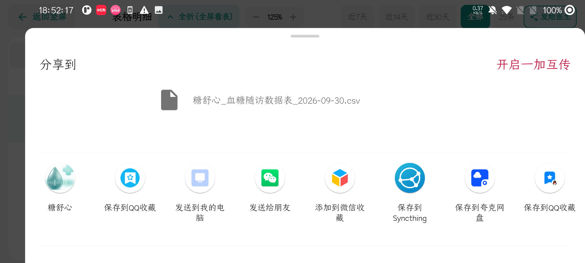
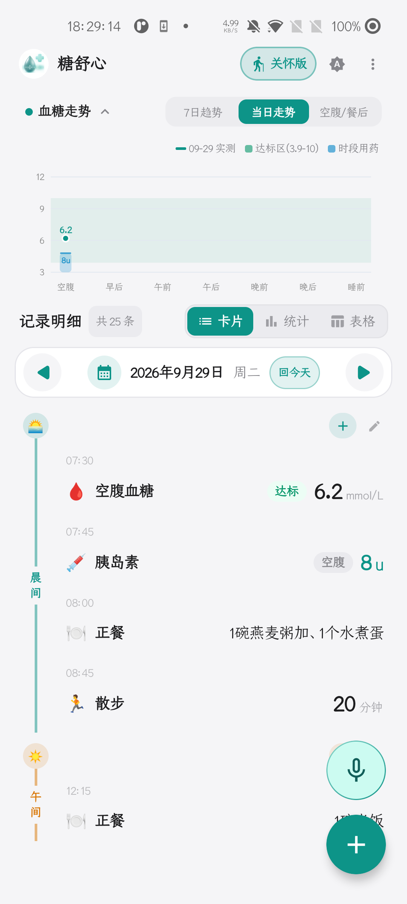
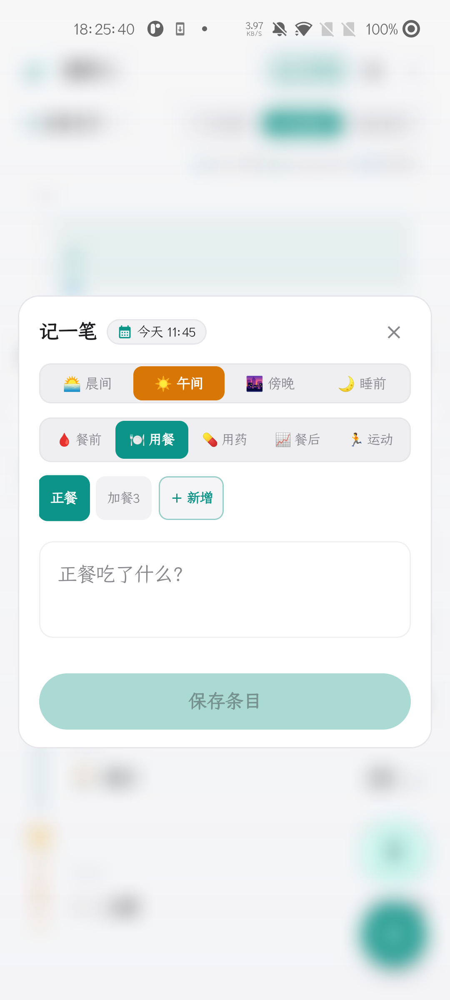
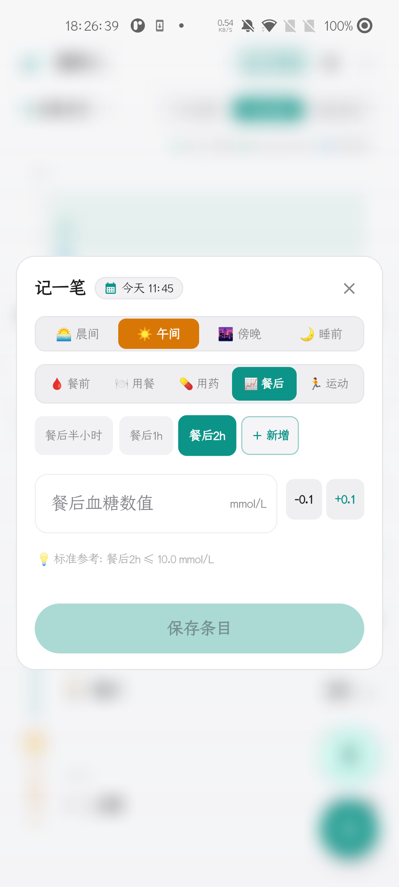

# 📖 GlucoDaily（糖舒心）全功能详细使用说明书

### 现代化 Android 离线智能控糖与胰岛素随访系统 · 官方图文操作指南

*(专为糖友、银发长辈及慢病照护家属编写 · 真实设备图文对照 · 详尽操作手册)*

---

## 📑 目录索引
- [第一章：新手安装与首次使用配置](#第一章新手安装与首次使用配置)
  - [1.1 麦克风录音权限与 100% 离线隐私保障](#11-麦克风录音权限与-100-离线隐私保障)
  - [1.2 双模式（适老关怀模式 ⇄ 标准专业看板）一键切换](#12-双模式适老关怀模式--标准专业看板一键切换)
- [第二章：适老关怀模式（深度图文教程）](#第二章适老关怀模式深度图文教程)
  - [2.1 主界面核心功能分布图解](#21-主界面核心功能分布图解)
  - [2.2 手把手「记一笔」操作全流程](#22-手把手记一笔操作全流程)
  - [2.3 智能药箱：品类选择、常用药历史与剂量点选](#23-智能药箱品类选择常用药历史与剂量点选)
  - [2.4 语音自动口播复述确认（TTS）](#24-语音自动口播复述确认tts)
  - [2.5 日期历史查看与未来日期防呆机制](#25-日期历史查看与未来日期防呆机制)
  - [2.6 放大横屏展示 & 一键发给医生（随访数据表格与临床报告分享）](#26-放大横屏展示--一键发给医生随访数据表格与临床报告分享)
- [第三章：端侧离线智能语音全流程指南 (SenseVoice AI)](#第三章端侧离线智能语音全流程指南-sensevoice-ai)
  - [3.1 怎么唤醒语音录入](#31-怎么唤醒语音录入)
  - [3.2 自然语言表达 6 种经典场景实测口诀](#32-自然语言表达-6-种经典场景实测口诀)
  - [3.3 社交媒体式平滑上滑隐退动效与实体自动提取](#33-社交媒体式平滑上滑隐退动效与实体自动提取)
- [第四章：标准专业模式深度解析](#第四章标准专业模式深度解析)
  - [4.1 全天七大生理时段卡片流与时间轴布局](#41-全天七大生理时段卡片流与时间轴布局)
  - [4.2 血糖走势图与全新坐标轴避让系统（7日趋势 ⇄ 当日走势）](#42-血糖走势图与全新坐标轴避让系统7日趋势--当日走势)
  - [4.3 记一笔全功能复合录入：正餐与无限加餐系统](#43-记一笔全功能复合录入正餐与无限加餐系统)
  - [4.4 餐后血糖多频段与加测管理](#44-餐后血糖多频段与加测管理)
  - [4.5 临床多维统计分析（TIR 达标率 / 血糖变异度 CV）](#45-临床多维统计分析tir-达标率--血糖变异度-cv)
  - [4.6 记录的重新修改与长按防误触安全删除](#46-记录的重新修改与长按防误触安全删除)
- [第五章：多维数据报表与就诊医生报告分享](#第五章多维数据报表与就诊医生报告分享)
  - [5.1 全维度汇总表格与日期周期筛选](#51-全维度汇总表格与日期周期筛选)
  - [5.2 横屏全景透视、全折满屏与捏合缩放](#52-横屏全景透视全折满屏与捏合缩放)
  - [5.3 一键导出结构化 CSV 与临床随访医生报告](#53-一键导出结构化-csv-与临床随访医生报告)
- [第六章：数据本地安全与离线换机备份](#第六章数据本地安全与离线换机备份)
- [第七章：版本迭代与说明文档持续维护规范](#第七章版本迭代与说明文档持续维护规范)
- [第八章：常见疑难排查与实用技巧 (FAQ)](#第八章常见疑难排查与实用技巧-faq)
- [附录：中国 2 型糖尿病临床血糖控制目标参考表](#附录中国-2-型糖尿病临床血糖控制目标参考表)

---

## 第一章：新手安装与首次使用配置

### 1.1 麦克风录音权限与 100% 离线隐私保障
首次打开 GlucoDaily（糖舒心）时，Android 系统会弹出如下权限请求：
> **“允许‘糖舒心’录制音频吗？”**

| 权限用途 | 传统云端健康 App | GlucoDaily（糖舒心） |
| :--- | :--- | :--- |
| **数据传输** | 上传到远程服务器转写 | **100% 手机芯片本地推理，零上传** |
| **网络要求** | 必须联网或 WiFi | **断网、飞行模式下依然秒级识别** |
| **隐私安全** | 存在健康数据泄露风险 | **计算完毕立即释放，数据绝不出手机** |

请放心点击 **“仅在使用中允许”** 或 **“始终允许”**。本项目为纯本地离线应用（Local-First），麦克风仅用于端侧语音大模型（SenseVoice-Small）在本地芯片上做声学特征提取，**绝无任何云端上报或广告监听行为**。

---

### 1.2 双模式（适老关怀模式 ⇄ 标准专业看板）一键切换
应用支持针对不同使用场景的两种界面布局：

| 适老关怀模式 (Care Mode) | 标准专业看板 (Standard Mode) |
| :---: | :---: |
|  |  |
| **银发长辈、老花眼、追求极简高效的用户** | **中青年糖友、精细化记录、医生门诊随访** |
| **24 ~ 32sp 超大号粗体**，高对比度立体气泡 | 现代紧凑时间轴卡片流，层次丰富明晰 |
| 单日状态聚焦、大字立体步进、语音复述口播 | 七大时段看板、走势图避让坐标、多加餐/加测 |

> 🔄 **双向无缝切换方法**：
> - **从关怀模式切到标准模式**：点击关怀主页顶栏最右侧的 **“标准版”** 按钮（带九宫格看板图标），即可一键回到标准看板；
> - **从标准模式切到关怀模式**：点击标准看板顶部工具栏上的 **“关怀版”** 按钮（带绿色关怀人形图标），即可瞬间切换至大字关怀模式。

---

## 第二章：适老关怀模式（深度图文教程）

### 2.1 主界面核心功能分布图解

  

1. **顶部操作与模式切换区**：
   - `[看板]`：当前大字卡片视图；
   - `[表格]`：一键直达适老大字表格与横屏透视；
   - `[超大]`：字体字号快速增大调节；
   - `[夜间模式]`：切换深色护眼主题；
   - `[标准版]`：一键切换回标准专业看板。
2. **日期历史导航区**：
   - 居中显示当前选定日期（如 `2026-09-29 历史记录` 或 `2026-09-30 【今天】`）；
   - 左侧 **`[← 前一天]`**：翻看昨天的历史记录；
   - 右侧 **`[后一天 →]`**：当处于今天时，**右侧按钮自动灰化禁用**，杜绝老年人翻到“未发生的明天”产生困惑。
3. **中心血糖状态大卡片**：
   - 显示最近一次测量的血糖值（如 `6.2 mmol/L 晨起空腹测得`）；
   - **三色健康胶囊预警**：
     - 🟢 **达标（绿色）**：处于健康控制目标区间（3.9 ~ 10.0 mmol/L）；
     - 🔵 **偏低（蓝色）**：血糖低于 3.9 mmol/L，提醒预防低血糖，及时补充含糖食物；
     - 🟠 **偏高（橙色）**：血糖高于 10.0 mmol/L，提醒关注就餐与注射用药；
   - **TTS 语音朗读大按钮**：点击卡片右侧扬声器图标，即可让手机大声口播当前状态与温馨健康提示。
4. **全天就餐分段卡片**：
   - 依次展示 **早餐 / 午餐 / 晚餐 / 睡前** 的空腹/餐前血糖、餐后血糖、胰岛素注射与用药详情。
5. **底部常驻操作专区**：
   - 底部左侧 **绿色「🎙️ 语音记一笔」大按钮**：开启端侧离线语音自然口述记录；
   - 底部右侧 **深绿色「✏️ 记一笔」大按钮**：唤起手工大字立体录入弹窗。

---

### 2.2 手把手「记一笔」操作全流程

  

#### 详细操作步骤：
- **步骤 1：唤起弹窗**  
  点击底部右侧 **「✏️ 记一笔」** 按钮，弹出专为长辈定制的大字录入弹窗。
- **步骤 2：确认就餐时段**  
  顶部选择本次记录属于 **早饭、中饭、晚饭 还是 睡前**（系统自动根据当前时钟智能高亮推荐当前餐次）。
- **步骤 3：选择记录指标**  
  大号标签栏支持一键切换录入：
  - **餐前**（空腹/餐前血糖录入）
  - **餐后**（餐后 2 小时等复测血糖）
  - **用药**（胰岛素、口服降糖药与注射针剂）
  - **饮食**（主食、蔬菜、肉蛋奶等日常饮食备忘）
- **步骤 4：32sp 居中大字与快捷颗粒选值**  
  - 针对测糖数值，视力不便的长辈不仅可以使用软键盘，还可以直接点击两旁的 **加大「- 0.5」和「+ 0.5」步进按键**；
  - 弹窗内置 **「常用血糖快速选」** 胶囊群（`5.2`、`5.8`、`6.5`、`7.0`、`7.8`、`8.5`），长辈手指轻轻一点即可填入最接近的血糖值，微调即可。
- **步骤 5：保存记录**  
  轻点底部大号绿色按钮 **「✓ 保存本餐记录」**，数据即刻安全保存并触发语音播报。

---

### 2.3 智能药箱：品类选择、常用药历史与剂量点选

| 用药选择器界面 | 常用药下拉历史与分类 |
| :---: | :---: |
|  |  |

为了解决老年长辈打字慢、药品专业名词长、容易输错的痛点，糖舒心专门研发了**智能无障碍药箱系统**：

1. **三大药品形态切换**：
   - 顶部提供 **💉 胰岛素**、**💊 口服药**、**💉 针剂**（GLP-1 等）大号单选胶囊。
2. **高频常用药下拉记忆（如右图）**：
   - 点击药名输入框右侧的 **「选药 ▾」** 按钮，系统会自动展开浮层，展示**最近高频使用的药物名录**；
   - 长辈只需用手指轻轻一点，药品名称立刻填入，一次打字都不需要！
3. **常用药品轻触快选**：
   - 界面平铺展示常用胰岛素（门冬胰岛素、甘精胰岛素、德谷胰岛素、地特胰岛素、赖脯胰岛素等）或常用口服药（二甲双胍、阿卡波糖、达格列净、西格列汀等），点击即选。
4. **就餐时机智能化防呆**：
   - 直观提供 **餐前 / 餐中 / 餐后** 三选项；
   - **智能防呆逻辑**：当记录时段切换为“睡前”时，系统会自动隐藏这三个就餐时机选项，避免长辈在睡前选错餐前餐后。
5. **快捷剂量颗粒点选**：
   - 胰岛素提供 **-1U / +1U** 步进按钮；口服药提供 **0.25片 / 0.5片 / 1片 / 2片** 常用胶囊块，轻点直接完成用药量填写。

---

### 2.4 语音自动口播复述确认（TTS）
长辈保存完记录后，经常担心：“刚才我到底记上没有？数字有没有点错？”  
糖舒心内置了 **系统级高品质 TTS 语音朗读引擎**：
- 每次在关怀模式下点击保存后，扬声器会自动以温和亲切的语速口播复述：
  > 🔊 *“已为您记录今天早餐前数据：血糖 6.2，注射甘精胰岛素 8 单位，口服二甲双胍 1 片。控制得很棒，请继续保持！”*
- 长辈无需凑近屏幕核对，听声音就能确定记录完全正确。

---

### 2.5 日期历史查看与未来日期防呆机制
- **查看历史记录**：点击顶部日期两侧的 **`[← 前一天]` 按钮**，可以翻看昨天、前天、大前天的全量血糖与用药卡片；
- **防呆安全锁**：当翻回到“今天”时，右侧前进按钮会自动灰化并锁定，防止长辈不小心点到未来未发生的日期而误记数据。

---

### 2.6 放大横屏展示 & 一键发给医生（随访数据表格与临床报告分享）

| 竖屏汇总表格视图 | 横屏大字全景透视表格 | 随访报告一键发给医生 |
| :---: | :---: | :---: |
|  |  |  |

- **使用场景**：每周自测总结、去医院内分泌科门诊复查就医，或向主管医生、营养师远程汇报血糖；
- **打开表格视图**：在顶栏点击 **「表格」** 标签，即可进入清晰大字表格浏览，顶部支持近7天、近14天、近30天与全部数据快速筛选；
- **核心功能**：
  1. **横屏大字全景透视 (`care_table_landscape.png`)**：
     - 点击悬浮的 **放大镜按键**，手机立即旋转进入全屏纯表格横屏透视模式，状态栏自动沉浸隐退；
     - 表格完整展示：**餐段、日期、昨睡前、空腹、用药、餐后2h、正餐与多加餐饮食**全部维度；
     - 支持双指自由捏合缩放（`0.75x ~ 2.5x` 舒适大字自由调节）及 **「^ 全折 (全屏看表)」** 模式，实现 100% 满屏无干扰查表。
  2. **一键发给医生 (`care_share_doctor.png`)**：
     - 点击右上角绿色 **`[发给医生]`** 按钮，系统自动生成临床就诊专用的结构化随访数据文件 `糖舒心_血糖随访数据表_日期.csv`；
     - 内置 UTF-8 BOM 编码，医生电脑 Excel 双击打开绝无乱码；
     - 调起原生分享面板，支持直接发送到微信、QQ、短信或企业微信。

---

## 第三章：端侧离线智能语音全流程指南 (SenseVoice AI)

  

### 3.1 怎么唤醒语音录入
- 在主界面底部轻点绿色的 **「🎙️ 语音记一笔」** 麦克风图标；
- 屏幕底部将优雅升起毛玻璃材质的流式语音交互窗口，伴随灵动的声波波纹与“正在倾听中...”状态，代表系统已经准备好倾听。

---

### 3.2 自然语言表达 6 种经典场景实测口诀
无需刻意按照机械格式说话，像平时和儿女或医生聊天一样自然口述即可：

#### 常用口述场景与示范：
1. **复合全能记录（推荐！）**：
   > 🗣️ *“早上空腹血糖 6.2，打了 8 单位甘精胰岛素，吃了一片二甲双胍”*  
   > ➔ **系统提取**：时段=早餐前 | 血糖=6.2 | 胰岛素=甘精 8U | 用药=二甲双胍 1片
2. **餐后复测场景**：
   > 🗣️ *“中午吃完饭两个小时测血糖 7.8”*  
   > ➔ **系统提取**：时段=午餐后2小时 | 血糖=7.8
3. **加餐与用药场景**：
   > 🗣️ *“下午三点加餐吃了个苹果，吃了两颗阿卡波糖”*  
   > ➔ **系统提取**：时段=午后加餐 | 饮食=苹果 | 用药=阿卡波糖 2片
4. **运动与时长场景**：
   > 🗣️ *“晚饭后在小区公园散步了 40 分钟，感觉很舒服”*  
   > ➔ **系统提取**：时段=晚餐后 | 运动=散步 40分钟
5. **睡前基础胰岛素注射**：
   > 🗣️ *“睡觉前测血糖 6.8，注射德谷胰岛素 12 单位”*  
   > ➔ **系统提取**：时段=睡前 | 血糖=6.8 | 胰岛素=德谷 12U
6. **单纯吃药记录**：
   > 🗣️ *“刚吃了半片格列美脲”*  
   > ➔ **系统提取**：用药=格列美脲 0.5片

---

### 3.3 社交媒体式平滑上滑隐退动效与实体自动提取
- **为什么需要上滑隐退？**  
  长辈一次性说很多话时，传统语音界面文字会越堆越多甚至超出屏幕被截断。糖舒心独家采用 **120dp 视口配合顶部渐隐遮罩**，先说出的文字会像刷社交短视频一样丝滑向上滑动并逐渐淡出隐藏，屏幕中央始终清晰展示正在说的最新内容。
- **智能实体分拣卡片**：  
  口述完毕后，点击红色 **「■ 说完了，点击停止」** 按钮（或静音 1.5 秒自动停止），系统在 **200 毫秒内** 完成本地自然语言解析，并在上方整齐列出提取到的各项实体卡片。检查无误后，轻点 **「保存记录」** 即可入库！

---

## 第四章：标准专业模式深度解析

### 4.1 全天七大生理时段卡片流与时间轴布局

  

标准模式为深度控糖患者提供全天候节奏追踪，页面分为：
- 🌅 **晨间时段 (Morning)**：反映夜间基础胰岛素分泌与肝糖输出（空腹血糖、晨间用药、正餐饮食、晨练运动）；
- ☀️ **午间时段 (Noon)**：午餐前、午餐用药、正餐与午后加餐、餐后血糖复测；
- 🌆 **傍晚时段 (Evening)**：晚餐前、晚间胰岛素、晚餐饮食、晚餐后加餐与晚间运动；
- 🌙 **睡前时段 (Bedtime)**：预防夜间无症状低血糖，指导睡前基础胰岛素加量或睡前适量加餐。

---

### 4.2 血糖走势图与全新坐标轴避让系统（7日趋势 ⇄ 当日走势）

| 7日综合血糖趋势曲线 | 当日走势 (坐标轴避让安全设计) |
| :---: | :---: |
|  |  |

#### 1. 当日走势坐标轴避让全新设计：
- **痛点解决**：以往同类健康软件在绘制当日走势图时，X 轴第一个刻度（如“空腹”）往往与 Y 轴刻度数字（3, 6, 9, 12）产生挤压重叠，末尾刻度（如“睡前”）容易贴合屏幕右边缘；
- **智能安全间距重构**：
  - **左侧避让**：在 [`TrendChart.kt`](file:///d:/Antigravity/project/血糖胰岛素/app/src/main/java/com/example/ui/components/TrendChart.kt) 中专门配置了 `paddingLeft = 28dp` 与 `slotInnerMargin = 14dp`，将 X 轴第一个标签“空腹”**向右收拢避让**，与 Y 轴的数值刻度保持充足呼吸空间，彻底消除文字与轴线粘连；
  - **右侧内敛**：最后一个标签“睡前”计算了向左安全内敛，远离屏幕边缘与阴影；
  - **达标区间高亮**：浅绿色阴影区域精准标示国际公认的 **3.9 ~ 10.0 mmol/L** 安全达标区；
  - **时段用药气泡**：当日各时段如果注射了胰岛素或口服了药物，在对应时段柱位上方会自动悬浮轻量蓝色气泡（如 `8u`），血糖波动与给药关系一清二楚！

#### 2. 7日综合趋势图表：
- 聚合近 7 天历史测糖，**绿色折线** 代表每日晨起空腹血糖，**橙色虚线** 代表餐后均值血糖，**灰蓝色背景柱** 代表每日胰岛素总剂量，一眼看穿一周以来的控糖平稳趋势。

---

### 4.3 记一笔全功能复合录入：正餐与无限加餐系统

  

#### 为什么需要多加餐管理？
临床上，很多糖尿病患者尤其是接受强化胰岛素治疗或妊娠期糖尿病（GDM）患者，必须采取“少食多餐”原则；剧烈运动前后也常需要应急加餐以预防低血糖。如果软件只能记一次用餐，加餐内容就会和正餐混成一团。

#### 糖舒心独创的无限加餐交互：
1. **水平滚动选项卡架构**：
   - 切换到 **“🍽️ 用餐”** 选项卡，默认展示 **`[正餐]`** 标签；
   - 紧随其后的是高亮带边框的 **`[+ 新增]`** 按钮；
2. **点击 `[+ 新增]` 自动拓展加餐**：
   - 每次点击 `[+ 新增]`，系统根据当前餐段已录入的加餐序号，智能生成 **`[加餐1]`**、**`[加餐2]`**、**`[加餐3]`**...；
   - 每个标签拥有独立的输入框、独立的就餐时间记忆；
   - 当某个标签内已录入内容时，标签右上方会自动点亮小圆点标记（`hasInputDot`），防止漏记或混淆；
3. **时间轴卡片流独立呈现**：
   - 保存后，主界面时间轴卡片上将逐行清晰展示：
     - `🍽️ 正餐`：*1碗燕麦粥、1个水煮蛋*
     - `🍽️ 加餐1`：*低脂无糖酸奶1盒*
     - `🍽️ 加餐2`：*苏打饼干2片*
   - 支持对单条加餐点击展开查看、长按弹出针对该条加餐的专属编辑与删除选项。

---

### 4.4 餐后血糖多频段与加测管理

  

与多加餐逻辑高度统一，糖舒心的餐后血糖管理支持：
- 预置 **`[餐后半小时]`**、**`[餐后1h]`**、**`[餐后2h]`** 常用复测时机；
- 点击 **`[+ 新增]`** 即可添加自由频次的餐后加测点；
- 输入框支持 **-0.1 / +0.1** 快捷步进调节，下方实时提示临床参考范围（*标准参考：餐后2h ≤ 10.0 mmol/L*）。

---

### 4.5 临床多维统计分析（TIR 达标率 / 血糖变异度 CV）

  

轻点明细栏上方的 **「📊 统计」** 按钮，即可进入多日聚合深度分析看板：
1. **周期控糖概况**：
   - 聚合 **近7天 / 近14天 / 近30天 / 全部** 测糖数据；
   - 自动计算 **平均血糖**、**TIR 达标率**、**最低血糖** 与 **最高血糖**。
2. **TIR (Time in Range) 目标范围内时间占比**：
   - 《中国 2 型糖尿病防治指南》金标准：**建议一般 2 型糖友维持 TIR ≥ 70%**；
   - 环形图精准分解四档分布：
     - 🟢 **目标达标 (3.9 ~ 10.0 mmol/L)**
     - 🟡 **轻度偏高 (10.1 ~ 13.9 mmol/L)**
     - 🔴 **显著偏高 (> 13.9 mmol/L)**
     - 🟣 **低血糖风险 (< 3.9 mmol/L，警戒线 < 4%)**
3. **全天血糖与用药时段对照折线图**：
   - 直观把脉每天各时段测定值与给药剂量气泡，辅助医生分析是否存在“黎明现象”或“苏木杰反应”。

---

### 4.6 记录的重新修改与长按防误触安全删除

  

- **修改已存数据**：
  - 点击记录卡片右上角或对应条目上的 **铅笔编辑图标**，唤出修改弹窗；
  - 弹窗各选项卡（餐前、用餐、用药、餐后、运动）右上角的小圆点清晰指示哪些项目已有数据；
  - 支持调整测量时间、数值步进增减，点击 **「保存修改」** 即可无损更新。
- **长按防误触安全删除**：
  - 长按任意记录条目或在修改弹窗中点击删除时，系统弹出 **高对比度红色警示二次确认框**，防止长辈日常误触碰导致珍贵的医疗随访数据丢失。

---

## 第五章：多维数据报表与就诊医生报告分享

### 5.1 全维度汇总表格与日期周期筛选
在主界面点击 **「▦ 表格」** 选项，即可开启全维度随访数据报表：
- 顶部支持按 **近7天、近14天、近30天、全部** 快速筛选数据周期；
- 纵轴按日期降序排列，横轴完整容纳 **昨睡前、空腹、用药、餐后、正餐与多加餐明细、运动**。

### 5.2 横屏全景透视、全折满屏与捏合缩放
- **横屏放大**：轻触右下角悬浮的放大镜按钮，手机秒级旋转进入沉浸式全屏纯表格模式；
- **全折满屏**：点击顶部 **「^ 全折 (全屏看表)」**，状态栏与导航栏完全退隐，查表沉浸度达 100%；
- **捏合缩放**：支持双指在屏幕上随意缩放（0.75x ~ 2.5x），字号随心变大变小，医生在电脑前也能看得一清二楚。

### 5.3 一键导出结构化 CSV 与临床随访医生报告
- 点击横屏或表格顶部的 **`[发给医生]`** 按钮；
- 系统自动打包生成包含完整时间戳、餐段、空腹/餐后血糖、胰岛素剂量、药品分类、多加餐饮食及运动记录的 **标准 UTF-8 BOM CSV 文件**（如 `糖舒心_血糖随访数据表_2026-09-30.csv`）；
- 同时生成结构化文字摘要，一键调起 Android 原生分享面板，直接发送到微信、企业微信或邮件。

---

## 第六章：数据本地安全与离线换机备份

1. **无账号、无广告、纯本地（Local-First）**：
   - 糖舒心不设手机号注册，不索取通讯录、定位或设备识别码；
   - 所有健康数据存储在 Android 隔离沙盒中的加密 SQLite 数据库内，完全归您个人所有。
2. **换机迁移操作指南**：
   - **第 1 步**：打开应用右上角菜单 ➔ 点击 **「导出本地数据备份」**；
   - **第 2 步**：系统将生成加密 `.json` 格式数据包，通过微信、QQ、蓝牙或数据线传送到新手机；
   - **第 3 步**：在新手机上安装糖舒心，点击 **「从文件恢复数据」**，选择备份文件即可一秒无缝迁移全量历史。

---

## 第七章：版本迭代与说明文档持续维护规范

> 📌 **工程交付质量硬性规范 (Documentation Maintenance Protocol)**：
> 
> 糖舒心开源项目团队郑重承诺，后续所有版本的开发迭代均严格遵循如下维护机制：
> 1. **代码与文档强同步**：凡涉及 Bug 修复、交互微调、算法重构或新功能上线，必须在提交代码的同时，同步刷新本使用说明书（[`USER_GUIDE.md`](./USER_GUIDE.md)）及 [`README.md`](./README.md) 中对应的章节描述；
> 2. **真机全真重新截屏**：严禁使用过时版本的设计稿或历史截图。任何涉及 UI 变动的模块，必须在真实 Android 测试设备上运行最新编译的 APK 进行全真截屏，替换保存至 `docs/images/`，确保图文与真实使用 100% 一致；
> 3. **避免遮挡与浮层干扰**：截屏前必须确保无临时 Toast 提示遮挡按键、无系统通知横幅下压，确保呈现最干净、最直观的界面演示；
> 4. **长辈视角防呆说明**：对每一个新增功能，必须详尽阐述适用场景、操作步骤、快捷微调与防呆措施，确保银发长辈与家属都能零门槛读懂学会。

---

## 第八章：常见疑难排查与实用技巧 (FAQ)

#### Q1: 语音记一笔时提示“未听到声音”或没有反应？
> **排查方法**：
> 1. 请前往手机 **「设置 ➔ 应用管理 ➔ 糖舒心 ➔ 权限」**，确认已开启“麦克风”权限；
> 2. 离线 AI 模型在每次打开弹窗时会有约 0.5 秒预热时间，**请等待声波波纹出现律动后再开始清晰说话**；
> 3. 请将嘴唇保持距手机底部麦克风 15~25 厘米距离，避免手指捂住麦克风孔。

#### Q2: 误将“晚餐”记成了“午餐”，需要删掉重记吗？
> **排查方法**：
> 不需要删除！点击该条记录卡片上的 **铅笔编辑图标**，直接在时段选项中改选为“晚餐”并保存，记录会自动移动到晚餐时间轴下。

#### Q3: 为什么有的长辈听不到语音自动播报？
> **排查方法**：
> 1. 请检查手机侧边的**物理静音按键**是否拨到了静音档，或者多媒体音量是否调到了零；
> 2. 确认手机系统内置有 TTS 语音引擎（华为小艺、小米小爱、OPPO Breeno 等各品牌手机均默认内置）。

#### Q4: 本软件需要充值 VIP 或者联网同步才能使用图表吗？
> **排查方法**：
> **完全不需要！所有功能终身免费且全离线可用**。我们遵循严格保护开源自由的 GNU GPLv3 开源协议，不含任何商业推广或付费暗扣代码。

#### Q5: 源码里的离线语音识别模型需要额外手动下载吗？
> **解答**：
> 1. **全量代码仓库**：本项目已通过 Git LFS 完整托管了 SenseVoice 离线模型，只要克隆时执行 `git clone` 或 `git lfs pull`，模型已自动包含在本地工程中，开箱即用，无需任何额外配置；
> 2. **普通用户**：直接前往 GitHub Releases 下载已打包内置完整模型的 `GlucoDaily_TangShuXin_v1.0.apk` 即可，在手机上一键安装直接体验。

---

## 附录：中国 2 型糖尿病临床血糖控制目标参考表

依据中华医学会糖尿病学分会（CDS）《中国 2 型糖尿病防治指南》，提供以下一般成年患者的常规控制目标作为自我随访参考：

| 监测时间节点 | 严格控制目标（青年/无并发症） | 一般成年患者常用目标 | 银发高龄/多并发症长辈宽松目标 |
| :--- | :---: | :---: | :---: |
| **空腹血糖 (mmol/L)** | 4.4 ~ 6.1 | **4.4 ~ 7.0** | 7.0 ~ 8.5 |
| **餐后 2 小时血糖 (mmol/L)** | < 7.8 | **< 10.0** | < 11.1 |
| **TIR 目标范围内时间** | ≥ 80% | **≥ 70%** | ≥ 50% |
| **严重低血糖发生率 (<3.0)** | 0% | **< 1%** | 极严格防范低血糖 |

> ⚠️ **温馨提示**：个体病情存在差异，上述目标仅供日常随访参考。具体胰岛素注射方案与控糖目标，**请务必以您的主治内分泌科医师给出的个体化处方为准**。
